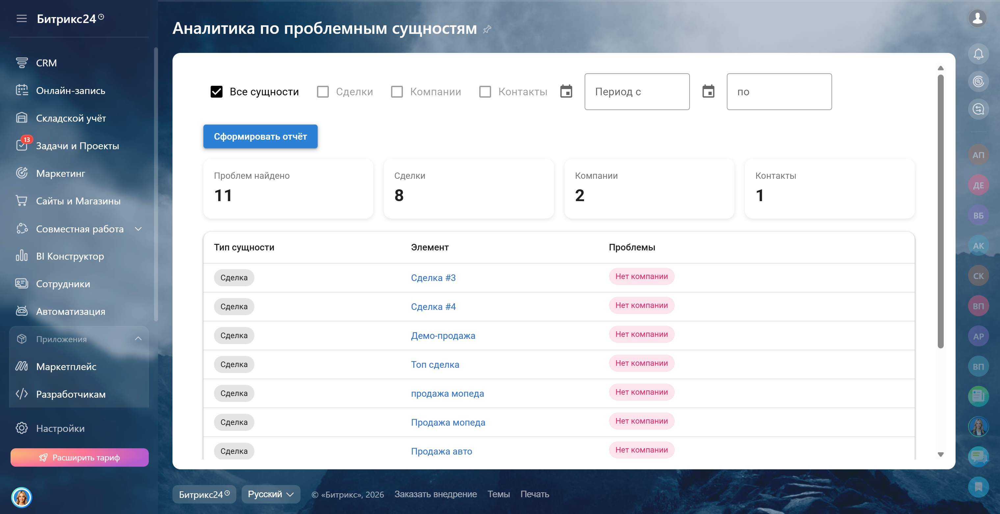
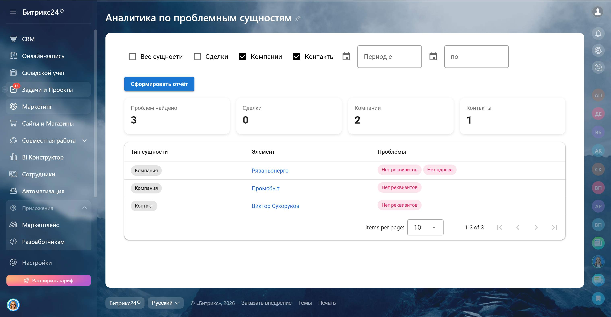
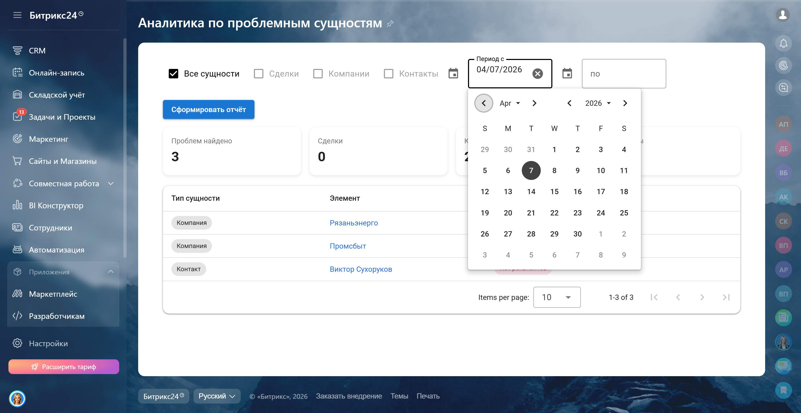

<h1>Отчет по проблемным сущностям в CRM 🔍</h1>

Инструмент для контроля качества данных в <b>Bitrix24</b>. 
Позволяет находить компании, контакты и сделки с незаполненными данными.

<h2>🔹 Демонстрация работы приложения</h2>

<table width="100%" cellpadding="1" border="1">
<tr align="center"><td>  

<em >Работа приложения в реальном времени</em></td></tr>

</table>

<table>
<tr>

<td align="center">
 
<em>Начальный экран</em>
</td>

<td align="center">
 
<em>Вывод проблемных данных</em>
</td>
</tr>

<tr>

<td align="center">
 
<em>Фильтрация по типу сущности</em>
</td>

<td align="center">
 
<em>Фильтрация по дате</em>
</td>
</tr>
</table>

<h2>🔹 Проблема</h2>

Клиент столкнулся с необходимостью:

<ul>
<li>Контролировать качество данных в CRM</li>
<li>Находить сущности с незаполненными обязательными полями</li>
<li>Избегать потери данных и ошибок в работе с клиентами</li>
</ul>

<h2>🔹 Решение</h2>

Разработал приложение, которое позволяет:

<ul>
<li>Автоматически выявлять проблемные компании, контакты и сделки</li>
<li>Показывать список незаполненных полей по каждой сущности</li>
<li>Быстро переходить в карточку для исправления данных</li>
<li>Фильтровать результаты по типу сущности и периоду</li>
</ul>

<h2>🔹 Логика проверки</h2>

<b>Компания:</b>

<ul>
<li>Отсутствует адрес</li>
<li>Не заполнены реквизиты</li>
<li>Нет телефона</li>
<li>Не привязан контакт</li>
</ul>

<b>Контакт:</b>

<ul>
<li>Отсутствует адрес</li>
<li>Не заполнены реквизиты</li>
<li>Нет телефона</li>
<li>Нет email</li>
</ul>

<b>Сделка:</b>

<ul>
<li>Не привязан контакт</li>
<li>Не привязана компания</li>
</ul>

<h2>🔹 Показатели отчета</h2>

<table>
<tr>
<th>Показатель</th>
<th>Описание</th>
</tr>
<tr>
<td>Сущность</td>
<td>Тип сущности (компания, контакт, сделка)</td>
</tr>
<tr>
<td>Название</td>
<td>Название элемента с переходом в карточку</td>
</tr>
<tr>
<td>Проблемы</td>
<td>Список незаполненных или некорректных полей</td>
</tr>
</table>

<b>Фильтры:</b>

<ul>
<li>Период (по дате создания)</li>
<li>Тип сущности</li>
</ul>

<h2>🔹 Использованные технологии</h2>

<ul>
<li><b>Frontend:</b> Vue + Vuetify, JavaScript, Sass, Vite</li>
<li><b>Интеграция:</b> Bitrix24 API</li>
<li><b>Было выделено времени:</b> 7 дней</li>
<li><b>Время разработки:</b> 5 дней разработка + 2 дня тестирование</li>
</ul>

<h2>🔹 Контакты</h2>

Если заинтересовало или хотите аналогичное приложение:  

Telegram: <a href="https://t.me/volodin7ergey">@volodin7ergey</a> 
VK: <a href="https://vk.com/volodin7ergey">vk.com/volodin7ergey</a>

